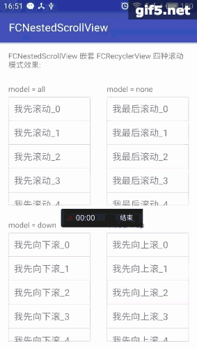
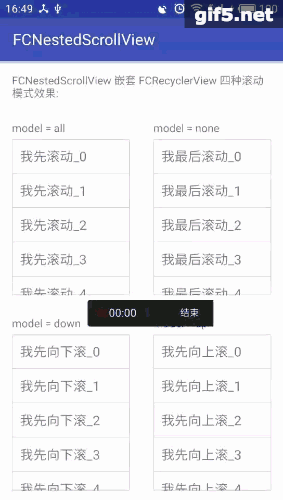
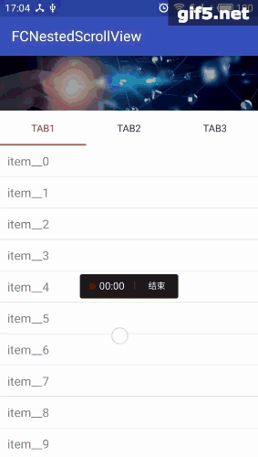

## FCNestedScrollView

主要是用来解决滚动嵌套问题，比如NestedScrollView 嵌套 RecyclerView，看了网上很多别人实现的代码，大部分都是让RecyclerView的高度等于所有item高度的总和；如果item比较少，可以这样实现，但是如果item比较多，并且可以一直上拉加载更多，这样的话就会导致界面严重卡顿，存在性能问题，因为没有用到recyclerview的缓存机制

而此项目的实现是被嵌套的RecyclerView定高，然后手动解决手势冲突问题，这样的话即使item再多也不存在性能问题

  	 


 	

maven地址

```
maven {
    url  "https://dl.bintray.com/403462630/maven"
}
```
gradle依赖

```
// support version 大于等于28，请使用1.3.3
compile 'com.fc.nestedscrollview:library:1.3.4'
// support version 低于等于27，请使用1.2.0
// compile 'com.fc.nestedscrollview:library:1.2.0'

```

### 此项目提供四个view

- FCNestedScrollView
- FCRecyclerView
- FCWebView
- FCSwipeRefreshLayout

### 注意

- 支持FCNestedScrollView 嵌套 FCNestedScrollView、FCRecyclerView、FCWebView
- 支持嵌套下拉刷新（目前只扩展了系统自带的SwipeRefreshLayout, 如果只是在最外层的滚动视图添加下拉刷新，则无任何限制）
- FCNestedScrollView支持多层嵌套（最少支持三层嵌套，更多层嵌套没测试过，按道理应该也可以）
- 不支持FCRecyclerView 嵌套FCNestedScrollView、FCWebView（基本上没这种需求）


### 三种可嵌套滚动view用法如下

### 自定义属性

##### fc\_scroll\_mode如下：

- none parentview优先滚动，然后自己消费
- all (默认)自己优先滚动，然后parentview消费
- up 自己优先向上滚，然后parentview消费
- down 自己优先向下滚，然后parentview消费

##### fc\_is_linked\_parent如下：

- true （默认）fling时，当自己滚动完成之后 传递给parentview继续fling
- false fling时，当自己滚动完成之后 不传递给parentview继续fling

##### fc\_is\_linked\_child 如下：

- true (默认)当自己滚到到顶部或底部的时候，联动childview继续fling
- false 当自己滚到到顶部或底部的时候，不联动childview继续fling

##### fc\_is\_nested\_scroll\_enabled(目前只有FCWebView支持，因为webview里的内容复杂、不可控，导致可能存在兼容性，建议 如果webview没有嵌套在其它可滚动视图里面，建议设置成false（或者使用原生的webview），否则设置成true)

- true (默认)
- false 不会添加任何手势处理，全使用系统默认的手势

##### fc\_is\_pull\_refresh\_intercept(仅FCSwipeRefreshLayout支持）

- true 下拉时，优先处理下拉刷新
- false (默认)下拉时，最后处理下拉刷新

```
<com.fc.nestedscrollview.FCNestedScrollView
    android:layout_width="150dp"
    android:layout_height="200dp"
    app:fc_scroll_mode="all">
    
	...
</com.fc.nestedscrollview.FCNestedScrollView>

```

```
<com.fc.nestedscrollview.FCRecyclerView
    android:layout_width="150dp"
    android:layout_height="200dp"
    app:fc_scroll_mode="all">
</com.fc.nestedscrollview.FCRecyclerView>

```

```
<com.fc.nestedscrollview.FCWebView
    android:layout_width="150dp"
    android:layout_height="200dp"
    app:fc_scroll_mode="all">
</com.fc.nestedscrollview.FCWebView>

```

```
<com.fc.nestedscrollview.FCSwipeRefreshLayout
    android:layout_width="150dp"
    android:layout_height="200dp">
</com.fc.nestedscrollview.FCSwipeRefreshLayout>

```


