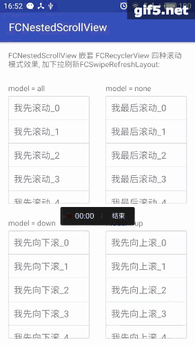

## FCNestedScrollView

  	 


 	

### 一个支持嵌套可滚动视图的NestedScrollView

- 支持NestedScrollView 嵌套 NestedScrollView、RecyclerView、webview
- 支持嵌套下拉刷新（目前只扩展了系统自带的SwipeRefreshLayout, 如果只是在最外层的滚动视图添加下拉刷新，则无任何限制）
- NestedScrollView支持多层嵌套
- 不支持RecyclerView 嵌套NestedScrollView、webview


maven地址

```
maven {
    url  "https://dl.bintray.com/403462630/maven"
}
```
gradle依赖

```
compile 'com.fc.nestedscrollview:FCNestedScrollView:1.0.0'

```

### 三种可嵌套滚动view用法如下

### 自定义属性

##### fc\_scroll\_mode如下：

- none parentview优先滚动，然后自己消费
- all (默认)自己优先滚动，然后parentview消费
- up 自己优先向上滚，然后parentview消费
- down 自己优先向下滚，然后parentview消费

##### fc\_is_linked\_parent如下：

- true （默认）fling时，当自己滚动完成之后 传递给parentview继续fling
- false fling时，当自己滚动完成之后 不传递给parentview继续fling

##### fc\_has\_pull\_down\_refresh（是否被FCSwipeRefreshLayout等下拉刷新控件（以后扩展）包裹，会导致view强制优先向下滚）如下：

- true 会导致view强制优先向下滚
- false (默认)

#####fc\_is\_nested\_scroll\_enabled(目前只有FCWebView支持，因为webview里的内容复杂、不可控，导致可能存在兼容性，建议 如果webview没有嵌套在其它可滚动视图里面，建议设置成false（或者使用原生的webview），否则设置成true)

- true (默认)
- false 不会添加任何手势处理，全使用系统默认的手势

```
//继承NestedScrollView
<com.fc.nestedscrollview.FCNestedScrollView
    android:layout_width="150dp"
    android:layout_height="200dp"
    app:fc_scroll_mode="all">
    
	...
</com.fc.nestedscrollview.FCNestedScrollView>

```

```
//继承RecyclerView
<com.fc.nestedscrollview.FCRecyclerView
    android:layout_width="150dp"
    android:layout_height="200dp"
    app:fc_scroll_mode="all">
</com.fc.nestedscrollview.FCRecyclerView>

```

```
//继承WebView
<com.fc.nestedscrollview.FCWebView
    android:layout_width="150dp"
    android:layout_height="200dp"
    app:fc_scroll_mode="all">
</com.fc.nestedscrollview.FCWebView>

```

```
//继承WebView
<com.fc.nestedscrollview.FCSwipeRefreshLayout
    android:layout_width="150dp"
    android:layout_height="200dp">
</com.fc.nestedscrollview.FCSwipeRefreshLayout>

```


